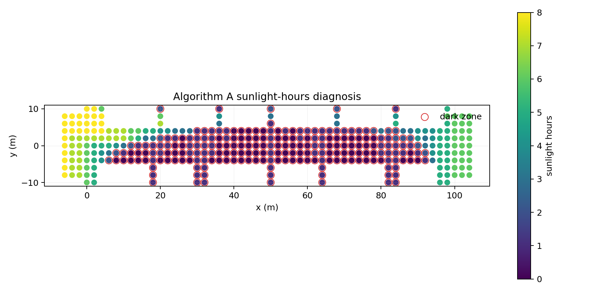
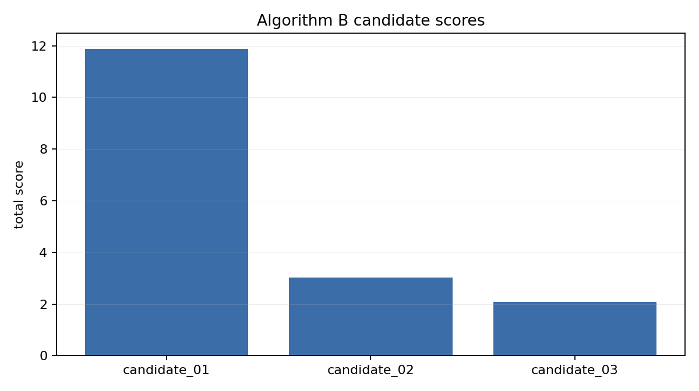
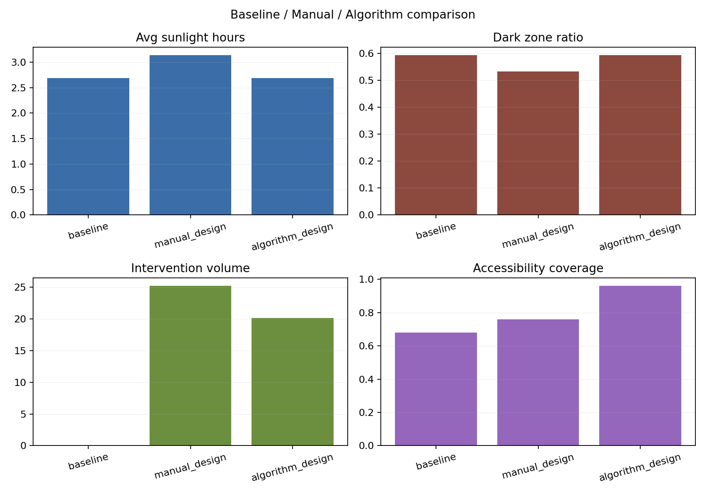

# Light Right Repair AI Prototype

AI-assisted spatial decision workflow for light-equity restoration in dense urban blocks.

This repository is a public-safe demo extracted from a larger private research project. It keeps the reusable algorithmic workflow and toy dataset, while excluding all real site data, raw CAD/Rhino/SketchUp files, field materials, team documents, and private project files.

## What It Does

The prototype runs a three-stage spatial decision workflow:

1. **Algorithm A - Diagnosis**  
   Simulates winter sunlight exposure on a simplified block model, identifies dark zones, and generates diagnostic heatmaps.

2. **Algorithm B - Candidate Generation**  
   Generates small intervention candidates under a minimal-intervention principle.

3. **Algorithm C - Validation**  
   Checks candidate interventions against accessibility and safety rules, then produces a final recommendation.

## Why It Matters

Light quality is a spatial justice issue in dense urban renewal. Instead of treating sunlight analysis as a final rendering check, this workflow treats it as an iterative design decision layer:

- where are the dark zones?
- which public-space gaps can be repaired with minimal intervention?
- which candidate improves light while preserving safety and accessibility?
- how can a designer compare algorithmic suggestions with manual design judgment?

## Public Demo Scope

Included:

- Python pipeline code
- public toy street dataset
- sample configuration files
- generated demo outputs
- heatmap and comparison figures

Excluded:

- real site data
- raw CAD/DXF/SKP/OBJ project files
- field photos and survey materials
- private group/team documents
- course or review materials
- real project output folders

## Quick Start

Install dependencies:

```bash
pip install -r requirements.txt
```

Run the public toy demo:

```bash
python main.py --dataset sample_toy_street --output-dir outputs/demo_run
```

Regenerate the toy dataset and run:

```bash
python main.py --dataset sample_toy_street --regenerate-toy --output-dir outputs/demo_run
```

## Repository Map

- `main.py` - command-line entry point for the A/B/C workflow
- `src/algorithm_a_diagnosis/` - sunlight diagnosis and dark-zone detection
- `src/algorithm_b_optimization/` - candidate generation and scoring
- `src/algorithm_c_validation/` - safety and accessibility validation
- `src/geometry/` - toy geometry and intervention mesh helpers
- `src/solar/` - simplified sun-path and sunlight simulation
- `src/visualization/` - heatmap and comparison chart generation
- `data/sample_toy_street/` - public toy dataset
- `config/` - public demo settings
- `outputs/demo_run/` - generated demo outputs
- `assets/figures/` - selected figures for README/portfolio review
- `docs/` - project positioning and privacy notes

## Demo Figures

### Diagnosis Heatmap



### Candidate Scores



### Before / After Comparison



## Status

Public-safe research prototype release.

The private project archive remains offline and is not published.

