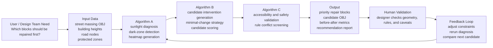

# AI Product Flow Diagram

This diagram explains Light Right Repair as an AI-assisted decision product, not as a pure modeling script.

## Product Manager Reading

- **User problem:** Designers need an explainable way to identify priority light-equity repair targets.
- **AI / algorithm role:** Convert spatial data into diagnosis, candidates, validation, and recommendations.
- **Output value:** Produce reviewable evidence instead of a black-box design result.
- **Validation:** Human designers remain responsible for checking geometry accuracy and planning feasibility.
